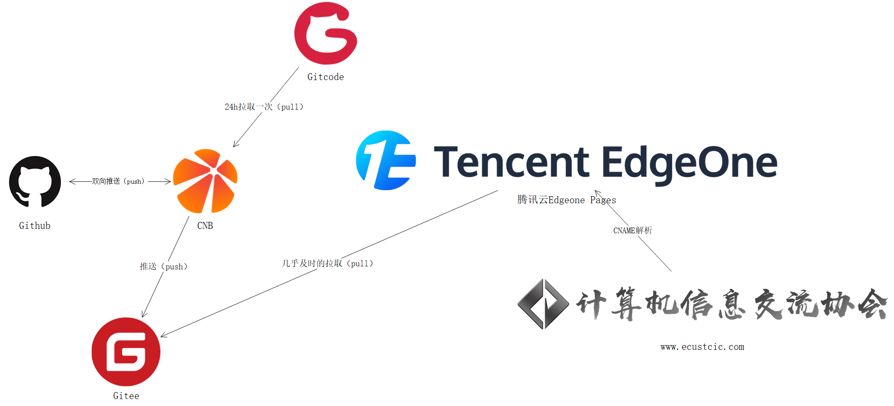

# ECUSTCIC 官方网站

这是华东理工大学计算机信息交流协会(ECUSTCIC)的官方网站项目。该网站提供协会信息、活动公告、电竞赛事以及交流群等内容，旨在促进校内计算机爱好者的交流与学习。

## 项目概览

本项目基于 Vue.js 构建，提供了友好的用户界面和丰富的功能模块，包括但不限于：

- 协会介绍与公告发布
- 电竞赛事信息与报名
- QQ交流群汇总与管理
- 活动回顾与展示

## 技术栈

- 前端框架：Vue.js
- UI组件：Bootstrap
- 图标库：Font Awesome
- 构建工具：Vue CLI

## 项目结构

项目的主要数据文件位于 `src/data` 目录下：

```
src/data/
├── esportsGames.js  # 电竞热门游戏数据
├── menu.js          # 技术文档数据
├── publicityData.js # 组宣新闻和活动数据
└── qqGroups.js      # QQ交流群数据
```

## 开发指南

### 环境准备

确保你已安装以下工具：
- Node.js (推荐 v14 或更高版本)
- npm (通常随 Node.js 一起安装)

### 安装依赖

```bash
npm install
```

### 本地开发服务器

```bash
npm run serve
```

启动后，可通过 `http://localhost:8080` 访问开发服务器。

### 构建生产版本

```bash
npm run build
```

构建后的文件将生成在 `dist` 目录中。

### 代码检查

```bash
npm run lint
```

## 数据修改指南

中心仓库为 CNB仓库：[https://cnb.cool/ecustcic/ecustcic-web](https://cnb.cool/ecustcic/ecustcic-web)，[GitHub](https://github.com/ECUSTCIC-CodeHub/ecustcic-web/)、[Gitcode](https://gitcode.com/ECUSTCIC-CodeHub/ecustcic-web/)、[Gitee](https://gitee.com/ecustcic/ecustcic-web)镜像仓库。  
⚠️修改请至 CNB仓库/GitHub，Gitcode、Gitee 镜像仓库仅用于同步。已建立 Github-CNB 双向同步。



### 修改电竞热门游戏数据

> 电竞部公共/赛事/活动直接调用[电竞部独立网站](https://ecustegame.top/)，不在本站修改，附上电竞部网站[Github仓库](https://github.com/hearthewind9/ecustegame-website)

编辑 `/src/data/esportsGames.js` 文件。

### 修改技术文档数据

编辑 `/src/data/menu.js` 以修改目录结构，`public\docs` 目录下存放文档内容。

### 修改交流群信息

编辑 `/src/data/qqGroups.js` 文件。

### 修改组宣新闻和活动

编辑 `/src/data/publicityData.js` 文件。

### 贡献方式

开启一个 Pull Request

## 自定义配置

有关更多配置信息，请参阅 [Vue CLI 配置参考](https://cli.vuejs.org/config/)。

## 许可证

[MIT](LICENSE) © ECUSTCIC